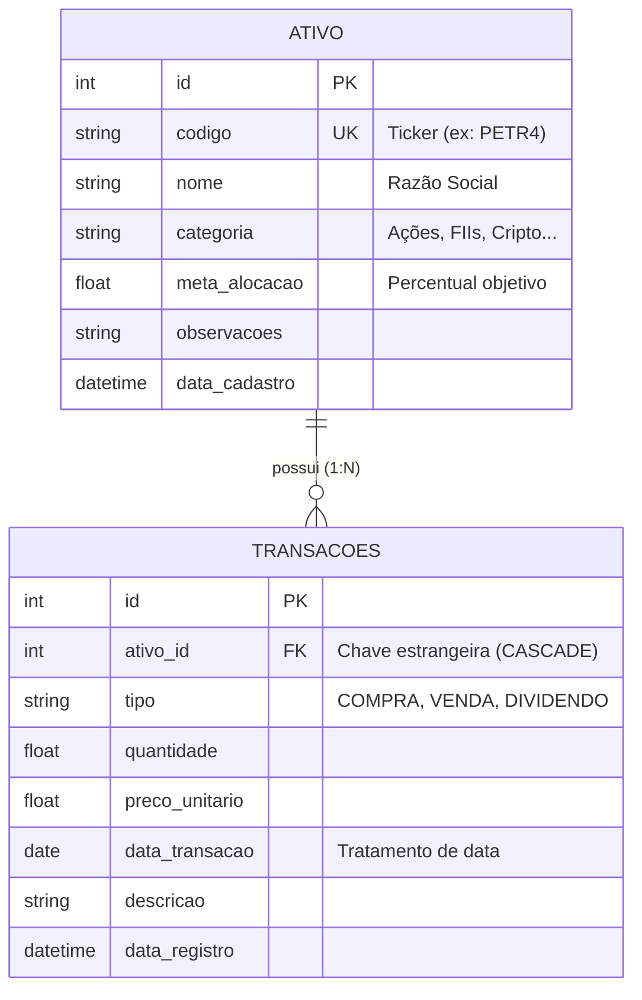

# 💼 AssetPulse API - Gestão Inteligente de Ativos & Investimentos


O **AssetPulse API** é um serviço RESTful moderno e de alta performance desenvolvido em Python e Flask, voltado para o controle patrimonial, consolidação de carteiras de investimentos multimercado (Ações, FIIs, Criptomoedas, Renda Fixa) e registro cronológico de movimentações financeiras com tratamento rigoroso de integridade relacional entre entidades.

A aplicação adota separação estrita de camadas (Rotas, Schemas de Contrato e Modelos ORM), cálculo em tempo real de métricas financeiras essenciais (preço médio ponderado, custódia líquida e proventos) e documentação interativa automatizada via OpenAPI 3.0 (Swagger UI).

---

## 🏛️ Alinhamento com as Key Constraints de Roy Fielding

A arquitetura deste serviço foi concebida respeitando rigorosamente as diretrizes fundamentais da Web propostas por Roy Fielding:

1. **Separação de Responsabilidades (Client-Server)**: A API atua exclusivamente na camada de negócio e persistência de dados, comunicando-se com o front-end através de payloads JSON padronizados, permitindo evolução e escalabilidade independente de ambos os lados.
2. **Interface Uniforme**: Endpoints semânticos utilizando verbos HTTP padronizados (`GET`, `POST`, `PUT`, `DELETE`), tipos de conteúdo uniformes (`application/json`) e códigos de status HTTP explícitos (`200 OK`, `201 Created`, `400 Bad Request`, `404 Not Found`, `409 Conflict`, `500 Server Error`).
3. **Ausência de Estado (Stateless)**: Cada requisição contém todas as informações necessárias para sua compreensão e processamento. Não há retenção de estado de sessão no servidor entre chamadas consecutivas.
4. **Sistema em Camadas**: O back-end é estruturado modularmente em Camada de Apresentação/Rotas (`app.py`), Camada de Validação/Contratos (`schemas.py`) e Camada de Domínio/Persistência (`models.py`).

---

## 📐 Arquitetura de Dados & Modelo Relacional

O banco de dados relacional utiliza o SQLite gerenciado pelo SQLAlchemy 2.0 ORM, implementando integridade referencial com chave estrangeira e deleção em cascata (`CASCADE`):



---

## 🚀 Funcionalidades da API

- **Múltiplas Tabelas Relacionadas (1:N)**:
  - `Ativo`: Entidade principal contendo código/ticker único (ex: `PETR4`, `HGLG11`, `BTC`), nome empresarial, classe/categoria, meta de alocação (%) e anotações.
  - `Transacao`: Movimentações vinculadas via chave estrangeira (`ativo_id`) com deleção em cascata (`CASCADE`), tipos de operação (`COMPRA`, `VENDA`, `DIVIDENDO`), volumes negociados, preço unitário e histórico cronológico com tratamento de datas financeiras.
- **Cálculos Consolidados em Tempo Real**:
  - **Quantidade em Custódia**: Total comprado menos o total alienado.
  - **Preço Médio Ponderado**: Ponderação de custos de aquisição pelas quantidades adquiridas.
  - **Proventos Acumulados**: Consolidação de dividendos e JCP auferidos por ativo e globais.
  - **Distribuição Patrimonial**: Agrupamento analítico e cálculo percentual por classe de ativos para tomadas de decisão de rebalanceamento.
- **Documentação OpenAPI 3.0 Nativa**: Swagger UI interativo integrado para testes, visualização de contratos e exemplos de requisição/resposta.
- **Suporte Multi-Origem (CORS)**: Configurado para viabilizar chamadas locais imediatas a partir de clientes Web nativos (inclusive protocolo `file://`).

---

## 🛠️ Tecnologias Utilizadas

- **Linguagem**: Python 3.10+ (testado e validado em 3.13)
- **Framework Web**: [Flask](https://flask.palletsprojects.com/)
- **Documentação & Validação de Esquemas**: [Flask-OpenAPI3](https://luolingchun.github.io/flask-openapi3/) com [Pydantic v2](https://docs.pydantic.dev/)
- **ORM / Persistência**: [SQLAlchemy 2.0](https://www.sqlalchemy.org/) com banco embutido [SQLite](https://www.sqlite.org/)
- **Segurança Cross-Origin**: [Flask-CORS](https://flask-cors.readthedocs.io/)
- **Testes Automatizados**: Módulo nativo `unittest` com client de testes isolado

---

## 📖 Mapeamento das Rotas da API

| Método | Rota | Descrição | Status Sucesso | Status Erros |
| :--- | :--- | :--- | :---: | :---: |
| `GET` | `/` | Redirecionamento automático para a documentação Swagger | `302` | - |
| `POST` | `/api/ativo` | Cadastra um novo ativo na carteira (ticker único) | `201` | `400`, `409` |
| `GET` | `/api/ativos` | Lista todos os ativos com totais e métricas calculadas em tempo real | `200` | `500` |
| `GET` | `/api/ativo` | Busca ativo específico por ID ou Código com histórico de transações | `200` | `400`, `404` |
| `PUT` | `/api/ativo` | Atualiza informações cadastrais de um ativo existente | `200` | `404`, `500` |
| `DELETE` | `/api/ativo` | Exclui um ativo e todas as suas transações vinculadas em cascata | `200` | `404`, `500` |
| `POST` | `/api/transacao` | Registra nova transação (`COMPRA`, `VENDA` ou `DIVIDENDO`) vinculada | `201` | `400`, `404` |
| `GET` | `/api/transacoes` | Lista transações registradas com filtros opcionais por ativo e tipo | `200` | `500` |
| `GET` | `/api/dashboard` | Retorna métricas executivas consolidadas e alocação por categoria | `200` | `500` |

---

## 📝 Exemplos de Payloads JSON

### 1. Cadastro de Ativo (`POST /api/ativo`)
```json
{
  "codigo": "VALE3",
  "nome": "Vale S.A.",
  "categoria": "Ações",
  "meta_alocacao": 15.0,
  "observacoes": "Líder global na extração de minério de ferro com forte política de dividendos."
}
```

### 2. Registro de Transação (`POST /api/transacao`)
```json
{
  "ativo_id": 1,
  "tipo": "COMPRA",
  "quantidade": 100.0,
  "preco_unitario": 62.50,
  "data_transacao": "2025-03-15",
  "descricao": "Aporte mensal via corretora"
}
```

### 3. Resposta Consolidada do Dashboard (`GET /api/dashboard`)
```json
{
  "patrimonio_investido": 14309.00,
  "total_proventos": 145.00,
  "quantidade_ativos": 3,
  "quantidade_transacoes": 4,
  "distribuicao_categorias": [
    {
      "categoria": "Criptomoedas",
      "total_investido": 5775.00,
      "percentual": 40.4,
      "quantidade_ativos": 1
    },
    {
      "categoria": "FIIs",
      "total_investido": 4884.00,
      "percentual": 34.1,
      "quantidade_ativos": 1
    },
    {
      "categoria": "Ações",
      "total_investido": 3650.00,
      "percentual": 25.5,
      "quantidade_ativos": 1
    }
  ]
}
```

---

## ⚙️ Instruções de Instalação e Execução

### 1. Clonar o Repositório
```bash
git clone https://github.com/mateuscarestiato/assetpulse-backend.git
cd assetpulse-backend
```

### 2. Criar e Ativar o Ambiente Virtual

**No Windows (PowerShell):**
```powershell
python -m venv .venv
.\.venv\Scripts\activate
```

**No Linux / macOS:**
```bash
python3 -m venv .venv
source .venv/bin/activate
```

### 3. Instalar Dependências
```bash
pip install -r requirements.txt
```

### 4. Executar o Servidor de Desenvolvimento
```bash
python app.py
```

A API estará disponível em:
- **Base URL**: `http://127.0.0.1:5000`
- **Swagger UI Interativo**: `http://127.0.0.1:5000/openapi/swagger`
- **Documentação OpenAPI JSON**: `http://127.0.0.1:5000/openapi/openapi.json`

> 💡 **Nota:** Ao iniciar pela primeira vez, o banco de dados `database.db` é criado e inicializado automaticamente com dados iniciais de demonstração (`PETR4`, `HGLG11`, `BTC`).

---

## 🧪 Testes Automatizados de Integração

A suíte de testes cobre integralmente todas as rotas e validações de regras de negócio:

```bash
python test_api.py
```

Cenários validados na suíte:
- [x] Listagem geral de ativos com verificação de estrutura (`GET /api/ativos`)
- [x] Busca específica por ticker com validação de histórico 1:N (`GET /api/ativo?codigo=PETR4`)
- [x] Fluxo CRUD completo (criação, leitura, atualização e exclusão)
- [x] Validação de unicidade e rejeição de ticker duplicado (`409 Conflict`)
- [x] Rejeição de tipos de movimentação não suportados (`400 Bad Request`)
- [x] Tratamento de buscas por ID inexistente (`404 Not Found`)
- [x] Integridade referencial e expurgo de transações em cascata (`CASCADE`)

---

## 📁 Estrutura do Projeto

```
assetpulse-backend/
│
├── app.py              # Ponto de entrada da aplicação Flask e mapeamento das rotas
├── models.py           # Modelos relacionais ORM (SQLAlchemy), conexão SQLite e seed
├── schemas.py          # Esquemas Pydantic v2 para validação de contratos e OpenAPI
├── test_api.py         # Suíte de testes de integração automatizados
├── requirements.txt    # Manifesto de dependências do Python
├── .gitignore          # Regras de exclusão do controle de versão
└── README.md           # Documentação técnica completa da API
```

---

## 👨‍💻 Autor

Desenvolvido por **Mateus Carestiato**  
GitHub: [@mateuscarestiato](https://github.com/mateuscarestiato)
